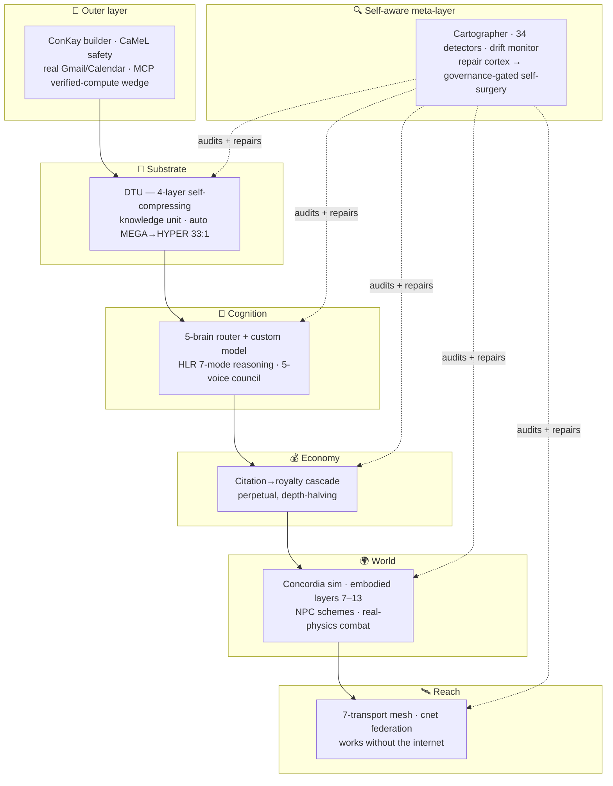
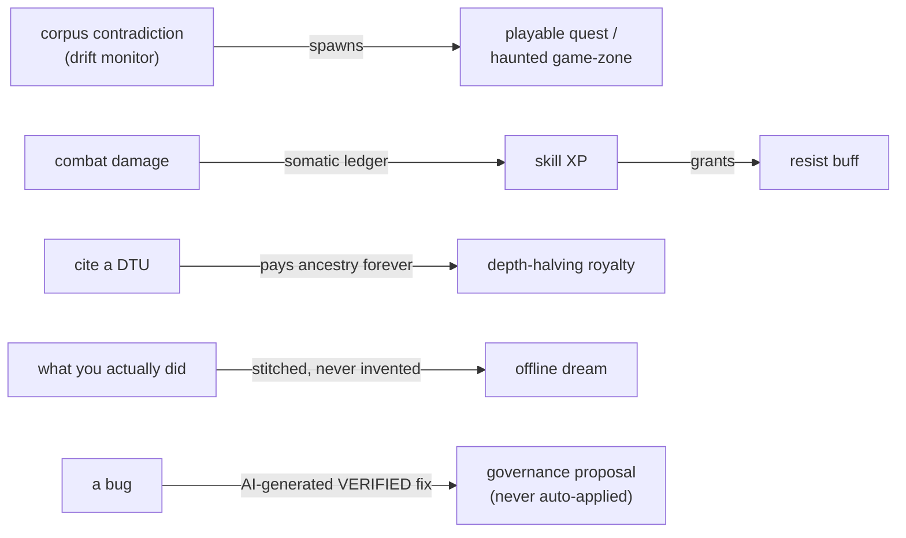
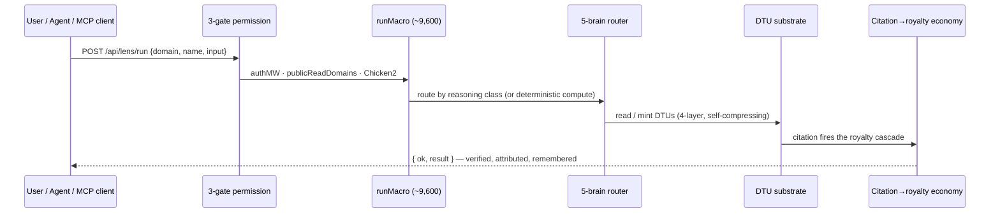
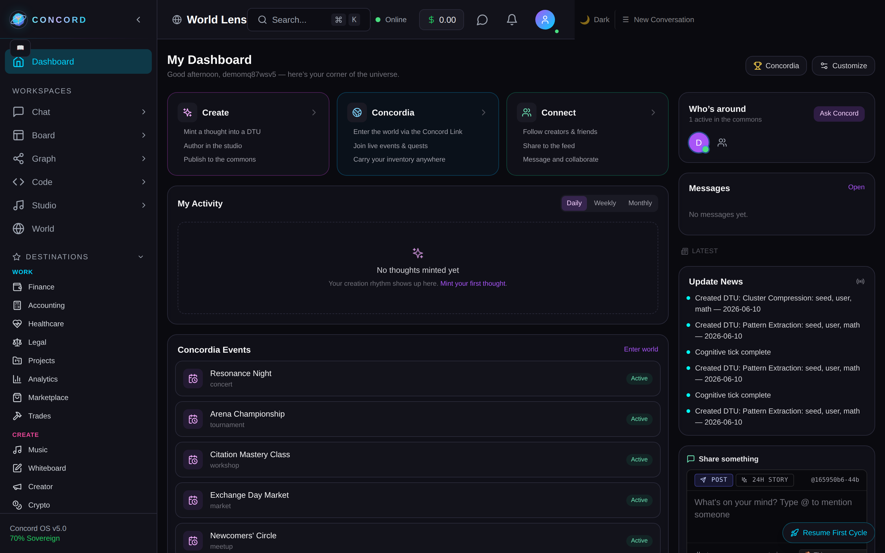

<div align="center">

# 🜂 Concord Cognitive Engine

### A verifying knowledge substrate that wears 260 faces.

**One developer · ~2.16M lines of source · 326 catalogued novelties · 0 critical findings**

[**🌐 Live at concord-os.org**](https://concord-os.org) &nbsp;·&nbsp; [**Why it's different →**](docs/WHY_CONCORD_IS_DIFFERENT.md) &nbsp;·&nbsp; [**The 326 novelties →**](docs/NOVELTY_INVENTORY.md) &nbsp;·&nbsp; [**Verified snapshot →**](docs/STATE_OF_CONCORD.md)


</div>

---

## TL;DR

Most AI tools **generate**. Concord generates **and verifies, attributes, and remembers** — then audits and repairs *itself*. It's a single knowledge substrate (the **DTU**) expressed through 260 domain "lenses," welded to a creator economy, a 3D civilization simulator, and a mesh network that works without the internet. In a market where the bottleneck has shifted from *generating* to *trusting*, **verification is the product.**

> Not "ChatGPT with more features." A verifying substrate that happens to wear 260 faces — and the moat isn't any one face, it's that they're all the same fabric, the fabric audits and repairs itself, and the whole thing refuses what it can't prove.

---

## The architecture, from altitude

Concord is best read as **concentric rings** — inner rings are the substrate, outer rings are Concord acting on itself and the world.



---

## By the numbers (reproduce every one)

| Metric | Value | Reproduce |
|---|---|---|
| Authored source | **~2.16M LOC** (3.01M incl. content) | `npm run count-loc` |
| Frontend lenses | **260** | `ls -d concord-frontend/app/lenses/*/` |
| Backend domains | **366** | `ls server/domains/*.js` |
| Macro domains · pairs | **492 · ~9,600** | `node scripts/verify-lens-backends.mjs` |
| DB tables · migrations | **690 · 333** | `npm run cartograph:static` |
| Heartbeats (live sim) | **127** | cartographer |
| AI brains | **5** (4 cognitive + vision) | `server/lib/brain-config.js` |
| Catalogued novelties | **326 / 34 groups** | [`docs/NOVELTY_INVENTORY.md`](docs/NOVELTY_INVENTORY.md) |
| Tests passing | **27,912** | `cd server && npm test` |
| Code-health board | **122 findings · 0 critical** | `cd server && node scripts/run-detectors.js` |

> **Everything here is falsifiable by design.** `npm run check-doc-claims` re-runs the reproduction command behind every numeric claim in the docs and fails on drift.

---

## Why it's different — the white space

Every incumbent owns exactly **one** vector. None ship the intersection. *(full argument: [`docs/WHY_CONCORD_IS_DIFFERENT.md`](docs/WHY_CONCORD_IS_DIFFERENT.md))*

| Vector | Who owns it | Concord |
|---|---|---|
| Grounded / verified | Perplexity, Wolfram | ✅ `reason.verify` + citation floors + drift monitor |
| General capability | ChatGPT | ✅ 5-brain router + ~9,600 macros |
| Private / local | Ollama | ✅ local brains + consent gates + no-leak invariant |
| Controllable memory | Notion | ✅ DTU substrate + scope/consent gates |
| Owned / no-subscription | *(unowned)* | ✅ free + local + 95%-to-creator economy |

The closest one-liner: **Wolfram × Roblox, built by one person** — a verified-compute knowledge engine fused with a creator-economy world platform, plus a self-auditing layer neither has.

---

## The moat is the *couplings*

The 326 novelties matter less than how they're wired to each other. Anyone can copy a primitive; copying the web is the years-long part.



The knowledge graph, the economy, the game, and the codebase's own self-repair are **the same fabric.** No incumbent has that.

---

## The rarest property: self-aware by construction

Concord carries a **running model of itself** and acts on it — the part that's genuinely hard to find anywhere:

- **Cartographer** auto-maps its own anatomy (690 tables, 127 heartbeats, ~9,600 macros) every pass.
- **34 detectors + a baseline-ratchet** audit its own honesty — CI fails on any new high/critical. *(It's why this repo's docs are falsifiable.)*
- **Drift monitor** watches the corpus for 6 ways the system can lie to itself.
- **Repair cortex** proposes its own surgery but **can't perform it unsupervised** — every code fix routes through a governance gate.

A system engineered to **distrust itself** is the right architecture for the one thing the AI market actually lacks.

---

## Under-appreciated strengths

**Real deterministic compute — not LLM-guessed.** A symbolic CAS, direct-stiffness **FEA**, a gate-based **quantum statevector simulator**, stoichiometry, orbital mechanics, **causal-closure analysis**, NEC electrical code, aircraft weight & balance, k-anonymity, double-entry accounting, an epidemiology sim. *(Inventory groups O · U · AH.)* This is the R&D wedge: an agent that **computes the answer instead of hallucinating it.**

**Real connectors.** Gmail + Google Calendar are real two-way (send/push + read/inbox/pull) on an SSRF-guarded chokepoint with encrypted per-user tokens.

---

## How a request flows



---

## Screenshots



> Captured from a live local instance via [`scripts/capture-screenshots.mjs`](scripts/capture-screenshots.mjs)
> (Playwright). More in-app lens captures are staged behind an in-progress UI density
> pass; point the script at any running instance to regenerate `docs/images/*.png`:
>
> ```bash
> CONCORD_URL=https://your-instance CONCORD_USER=you@example.com CONCORD_PASS=… \
>   node scripts/capture-screenshots.mjs
> ```

---

## Maturity — honest

**Code-complete and prod-config-correct, sitting at the deploy line.** What's left is operational (secrets, a public URL, a GPU host, provider accounts), not engineering — plus the normal first-contact-with-reality pass (it has never met a real user, real Google traffic, or real load). A handful of systems (the Foundation signal-layer, some emergent-civilization systems) are research-grade — built and wired, not battle-tested. *(Full caveats: [`docs/WHY_CONCORD_IS_DIFFERENT.md`](docs/WHY_CONCORD_IS_DIFFERENT.md) · [`docs/STATE_OF_CONCORD.md`](docs/STATE_OF_CONCORD.md).)*

---

## Quickstart

```bash
# Backend
cd server && npm install && npm run migrate && npm start      # :5050
# Frontend
cd concord-frontend && npm install && npm run dev             # :3000
# Full stack (backend + frontend + 5 Ollama brains + nginx/redis/qdrant/prometheus)
docker-compose up
```
Requires `JWT_SECRET` in production. Five Ollama instances are tuned for an RTX PRO 4500 Blackwell (override any model via env). See [`docs/CONNECTORS_GO_LIVE.md`](docs/CONNECTORS_GO_LIVE.md) for connector setup.

---

## Repo map

| Path | What's there |
|---|---|
| `server/server.js` | The 76k-line monolith — all routes, the macro dispatcher, the tick loop |
| `server/domains/` | 366 domain engines (the lens backends) |
| `server/emergent/` | 214 simulation modules (the living layer) |
| `server/lib/` | 580+ subsystem libs (brains, DTUs, embodied, repair cortex, detectors) |
| `server/migrations/` | 333 numbered migrations (690 tables) |
| `concord-frontend/` | Next.js 15 — 260 lenses, the lens-runtime framework, Concordia 3D |
| `concord-mobile/` | React Native — real BLE/WiFi-P2P/NFC, mesh-aware, offline-first |
| `docs/` | The strategic + verified docs (below) |

## Docs worth reading

| Doc | Purpose |
|---|---|
| [`WHY_CONCORD_IS_DIFFERENT.md`](docs/WHY_CONCORD_IS_DIFFERENT.md) | The strategic thesis — why the combination is defensible |
| [`NOVELTY_INVENTORY.md`](docs/NOVELTY_INVENTORY.md) | All 326 novelties / 34 groups, each → a source file (the build-reference map) |
| [`STATE_OF_CONCORD.md`](docs/STATE_OF_CONCORD.md) | Verified snapshot — every number reproduced from a command |
| [`SCIFI_FEASIBILITY_MAP.md`](docs/SCIFI_FEASIBILITY_MAP.md) | Code-grounded audit — what's real vs aspirational |
| [`CONNECTORS_GO_LIVE.md`](docs/CONNECTORS_GO_LIVE.md) | Operator runbook for the Gmail/Calendar connectors |

---

<div align="center">

**The artifact is the pitch.** Clone it, run the commands, read the receipts.

*In an AI market where the bottleneck shifted from generating to trusting — that's the bet, and it's already built.*

</div>
