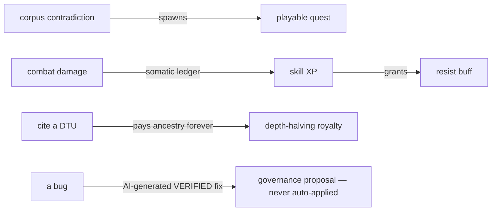
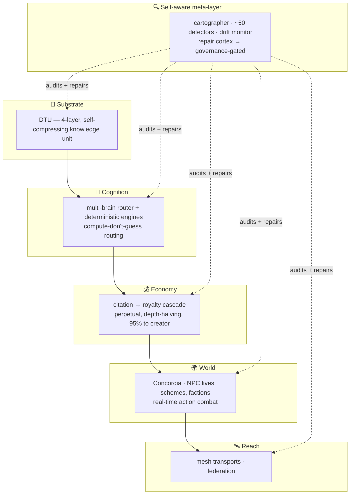

<div align="center">

# 🜂 Concord

### AI that shows its receipts.

**Ask a question that has a real answer, and Concord computes it** — with a symbolic math engine, a structural FEA solver and other deterministic engines — **then cites it and remembers it.** Around that sits a whole operating system of apps ("lenses"), a creator economy that pays for citations, and **Concordia**, a living world you can play in your browser.

Built by one person.

<br/>

### [→ Try it: concord-os.org](https://concord-os.org/explore)

*Live. Browse without an account · [watch the world live](https://concord-os.org/spectate/concordia-hub) · sign up free to chat, create, and play.*

<br/>

[](https://concord-os.org/explore)

<br/>


</div>

---

<details>
<summary><b>Contents</b></summary>

- [Why it exists](#why-it-exists)
- [Try it](#try-it)
- [What's inside](#whats-inside)
- [Why it's different](#why-its-different)
- [Maturity, honest](#maturity-honest)
- [The receipts](#the-receipts)
- [Architecture](#architecture-from-altitude)
- [For partners and investors](#for-partners-and-investors)
- [License](#license)
- [Repo map](#repo-map)

</details>

---

## Why it exists

AI tools got good at *sounding* right. The thing now blocking real work isn't capability — it's that you can't trust unchecked output in a workflow that matters, and agent projects stall for exactly that reason.

Concord's rule is **compute, don't guess.** When a question has a deterministic answer — an integral, a beam deflection, a balance sheet — Concord routes it to a real engine instead of letting a language model improvise, and keeps the result as a cited, reusable record.

```text
you:      What is 1234 × 5678?
concord:  1234 × 5678 = 7,006,652          ← from the symbolic engine, not the model
```

*(That exact example is a regression test: a small model once answered 7,031,242. Now the engine answers.)*

---

## Try it

**Engineers, researchers, the curious** — sign up free at [concord-os.org](https://concord-os.org/explore), then:

1. Open **Chat** and ask for a calculation — arithmetic, an integral, a unit conversion.
2. Open the **Math** lens for the CAS directly (`∫ x² dx → x³/3 + C`), or **Engineering** for parametric parts and beam-frame FEA.
3. Save what you learned as a **DTU** — Concord's knowledge unit — and cite it later; citations pay the author.

**Players** — [watch Concordia live, no account](https://concord-os.org/spectate/concordia-hub), or sign up and open the **World** lens to play (Unity WebGL, runs in the browser).

**Run it yourself:**

```bash
git clone https://github.com/ConcordDev/concord-cognitive-engine
cd concord-cognitive-engine

cd server && npm install && npm run migrate && npm start      # :5050
cd ../concord-frontend && npm install && npm run dev          # :3000
# or the full stack (backend + frontend + Ollama brains + nginx/redis/qdrant/prometheus):
docker-compose up
```

Production needs `JWT_SECRET`. Running the frontend standalone? Copy `concord-frontend/.env.example` → `.env.local` first. Realtime needs a WebSocket-aware proxy (nginx config included). Full setup: [`DEPLOYMENT.md`](DEPLOYMENT.md).

---

## What's inside

- **Deterministic compute.** A symbolic CAS, direct-stiffness beam-frame FEA, a quantum statevector simulator, orbital mechanics, double-entry accounting, statistics — called by chat and by the lenses, so answers are *computed*.
- **266 lenses.** Each reads as the app it replaces — a Bloomberg-style terminal, a VS Code shell, an Ableton-style timeline — on one shared substrate and one macro spine.

  | Finance lens | Code lens |
  |---|---|
  | [](https://concord-os.org/lenses/finance) | [](https://concord-os.org/lenses/code) |

- **DTUs — owned, cited memory.** A four-layer knowledge unit (human summary, structured claims, machine layer, optional artifact) that consolidates over time and keeps its lineage.
- **A citation economy.** Cite a DTU and its ancestry earns a perpetual, depth-halving royalty; 95% goes to creators.
- **Concordia.** A persistent world whose people live their own lives — jobs, grudges, schemes, grief — with real-time action combat. Unity client in the browser; a Godot client too.
- **ConKay.** A voice-capable assistant that rides the same chat and tools.
- **A layer that distrusts itself.** ~50 detectors on a CI ratchet, a drift monitor, and a repair cortex that proposes fixes but **cannot apply them unsupervised** — every code change goes through a governance gate.

---

## Why it's different

Every incumbent owns one vector. None ships the intersection ([market research](docs/MARKET_DEMAND_MAP.md)):

| Vector | Who owns it | Concord |
|---|---|---|
| Grounded / verified | Perplexity, Wolfram | deterministic engines + citation-resolution checks + a drift monitor |
| General capability | ChatGPT | multi-brain router + ~10.6k macros |
| Private / local | Ollama | self-hostable brains + consent gates |
| Controllable memory | Notion | DTU substrate with scope/consent gates |
| Owned economy | *(unclaimed)* | 95%-to-creator citation royalties |

The moat is that these are **one fabric** — the knowledge graph, the economy, the world and the codebase's own self-repair:


```mermaid
flowchart LR
    DRIFT["corpus contradiction"] -->|spawns| QUEST["playable quest"]
    PAIN["combat damage"] -->|somatic ledger| XP["skill XP"] -->|grants| BUFF["resist buff"]
    CITE["cite a DTU"] -->|pays ancestry forever| ROYALTY["depth-halving royalty"]
    BUG["a bug"] -->|AI-generated VERIFIED fix| GATE["governance proposal — never auto-applied"]
```

The full thesis: [`WHY_CONCORD_IS_DIFFERENT.md`](docs/WHY_CONCORD_IS_DIFFERENT.md) · every novelty mapped to a source file: [`NOVELTY_INVENTORY.md`](docs/NOVELTY_INVENTORY.md) · the plan: [`GO_TO_MARKET.md`](docs/GO_TO_MARKET.md).

---

## Maturity, honest

| Solid | In progress | Not yet |
|---|---|---|
| Live at concord-os.org; signup, chat, lenses and per-user privacy exercised by a new-user QA journey (2026-09-27). | Production AI runs on a dedicated GPU box; while it's offline the site falls back to a small local model and chat quality drops. | No heavy-load run against production yet. Load *shedding* (admission control on event-loop lag) is built and was tuned against real stalls found in QA. |
| Arithmetic in chat is computed by the engine, not the model; math/FEA engines are deterministic and test-pinned. | "Verify" today means **checking that a claim's citations resolve** — not fact-checking arbitrary uncited text. Claim-level grounding is on the roadmap. | Hosting still runs on one machine; the move to dedicated infra is planned ([blueprint](docs/OFF_MAC_MIGRATION_BLUEPRINT.md)). |
| Private operator systems (trading agents, internal organs) are locked to the operator; public accounts get an honest `operator_only`. | The in-browser Concordia build lags the latest gameplay work; a fresh export is queued. | Six connectors (Gmail, Calendar, Slack, Sheets, GitHub, Notion) are code-complete; going live needs OAuth credentials, not code. |

Deeper caveats: [`WHY_CONCORD_IS_DIFFERENT.md`](docs/WHY_CONCORD_IS_DIFFERENT.md#honest-caveats-what-it-is-not) · measured live-vs-overclaim: [`STACK_REALITY.md`](docs/STACK_REALITY.md).

---

<div align="center">

## The receipts

*Everything below reproduces from a command. That's the point.*

</div>

| Metric | Reproduce |
|---|---|
| Authored source (~2.8M LOC, excl. content) | `npm run count-loc` |
| Lenses · backend domains | `ls -d concord-frontend/app/lenses/*/` · `ls server/domains/*.js` |
| Macro domains · `(domain, macro)` pairs (~565 · ~10.6k) and lens wiring | `node scripts/verify-lens-backends.mjs` |
| Numbered migrations | `ls server/migrations/[0-9]*.js` |
| Heartbeats driving the live simulation (~143) | `grep -rohE "registerHeartbeat\(['\"][a-z0-9-]+['\"]" server/ --exclude-dir=tests \| sort -u \| wc -l` |
| Tests | `cd server && npm test` |
| Detector board | `cd server && node scripts/run-detectors.js` — the CI ratchet blocks *new* high/critical findings |

> `npm run check-doc-claims` re-runs the command behind every numeric claim in `docs/` and fails the build on drift. Current values: [`docs/STATE_OF_CONCORD.md`](docs/STATE_OF_CONCORD.md).

---

## Architecture, from altitude


```mermaid
flowchart TD
    subgraph R1["🧬 Substrate"]
        DTU["DTU — 4-layer, self-compressing knowledge unit"]
    end
    subgraph R2["🧠 Cognition"]
        BRAINS["multi-brain router + deterministic engines<br/>compute-don't-guess routing"]
    end
    subgraph R3["💰 Economy"]
        ECON["citation → royalty cascade<br/>perpetual, depth-halving, 95% to creator"]
    end
    subgraph R4["🌍 World"]
        WORLD["Concordia · NPC lives, schemes, factions<br/>real-time action combat"]
    end
    subgraph R5["🛰️ Reach"]
        MESH["mesh transports · federation"]
    end
    subgraph R6["🔍 Self-aware meta-layer"]
        META["cartographer · ~50 detectors · drift monitor<br/>repair cortex → governance-gated"]
    end
    DTU --> BRAINS --> ECON --> WORLD --> MESH
    META -.audits + repairs.-> DTU & BRAINS & ECON & WORLD & MESH
```

**How a request flows:** `POST /api/lens/run` → permission gates → `runMacro` (a brain *or* a deterministic engine) → read/mint DTUs → a citation fires the royalty cascade → `{ ok, result }`.

Deeper: [`ARCHITECTURE.md`](ARCHITECTURE.md) · [`API.md`](API.md)

---

## For partners and investors

**Stage:** live at [concord-os.org](https://concord-os.org), pre-revenue, one founder, AI-accelerated. Seeking design partners — especially **engineering and R&D teams who need an agent that computes instead of guessing** — and pre-seed conversations.

**Why now.** Agents are shipping everywhere, and the blocker is trust. "Deterministic compute an agent can call, with a citation trail" is an unclaimed wedge, and Concord is a working instance of it ([research](docs/MARKET_DEMAND_MAP.md) · [plan](docs/GO_TO_MARKET.md)).

**Contact:** Concord Dev — [dutchtropez@gmail.com](mailto:dutchtropez@gmail.com)

---

## License

**Concord Source License – Community Edition (CSL-CE 1.0)** — source-available, **not** OSI open-source. See [`LICENSE.txt`](LICENSE.txt).

You **may**: run and self-host privately, study and modify for non-commercial research/education, create DTUs for private use, contribute back via PR, fork for personal/research use.

You **may not** without a written grant: sell or commercially distribute it, offer it as a hosted service, operate a derivative marketplace or a competing global network, or monetize DTUs / lineage graphs / Concord-derived assets. Commercial licensing is available.

"Concord," "ConcordOS," "DTU," "Hyper-DTU," and associated marks are not licensed. Dependency/model license posture: [`docs/LICENSING.md`](docs/LICENSING.md).

---

## Repo map

| Path | What's there |
|---|---|
| `server/server.js` | The monolith by deliberate choice — routes, admission control, and the background simulation tick |
| `server/domains/` | ~440 domain engines (the lens backends) |
| `server/emergent/` | ~240 simulation modules (the living layer) |
| `server/lib/` | ~1,300 subsystem libraries (brains, compute, DTUs, runtime, detectors) |
| `server/migrations/` | ~450 numbered migrations |
| `concord-frontend/` | Next.js — 266 lenses, the lens runtime, ConKay, the Concordia web host |
| `apps/concordia-living-world/` | The Concordia Unity client |
| `world-lens-godot/` | A Godot 4 client for Concordia |
| `concord-mobile/` | React Native — BLE / WiFi-P2P / NFC, offline-first |
| `sdk/` | Developer SDK + examples |
| `docs/` | Verified strategy and state docs |

**Worth reading:** [`GO_TO_MARKET.md`](docs/GO_TO_MARKET.md) · [`MARKET_DEMAND_MAP.md`](docs/MARKET_DEMAND_MAP.md) · [`WHY_CONCORD_IS_DIFFERENT.md`](docs/WHY_CONCORD_IS_DIFFERENT.md) · [`STATE_OF_CONCORD.md`](docs/STATE_OF_CONCORD.md) · [`SECURITY.md`](SECURITY.md)

---

<div align="center">

**The artifact is the pitch.** Ask it something with a real answer — or [walk in the door](https://concord-os.org/explore).

</div>
